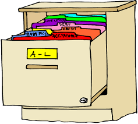

<!-- README.md is generated from README.Rmd. Please edit that file -->

```{r, echo = FALSE}
library(magrittr)

knitr::opts_chunk$set(
  collapse = TRUE,
  comment = "#>",
  fig.path = "README-"
)
```

# sampleDB <a href='https://eppicenter.github.io/sampleDB-rpackage/'></a>

<!-- badges: start -->
<!-- [](https://cran.r-project.org/package=tidyr) -->
<!-- [](https://github.com/tidyverse/tidyr/actions/workflows/R-CMD-check.yaml) -->
<!-- [](https://app.codecov.io/gh/tidyverse/tidyr?branch=main) -->
<!-- badges: end -->
  
## Overview

sampleDB is an R package that allows users to *Upload, Search and Modify* a database of EPPIcenter wetlab samples using simple function calls or using a RShiny App.

## Installation

sampleDB comes pre-loaded onto Aragorn's R Server. 

To interact with the database simply log onto Aragorn and load sampleDB.

```{r}
library(sampleDB)

SearchSamples(sample_type = "all")$`Study Subject` %>% head()
```

## The Database

The database is broken down into three sections

* *Internal Data* a immutable section of the database consisting of:

  + `study subjects` a list of participants involved in EPPIcenter studies

  + `specimens` the unique combination of specimen type, study subject, and collection date that currently exists at the EPPIcenter

  + `storage containers` the link between the `specimen`, the `sample type`, and the `sample statuses` to a freezer in the EPPIcenter lab

* *External Data* a mutable section of the database consisting of:

  + `samples` the tangible wetlab sample either in the form of a micronix tube, a cryovial, RDT or paper

  + `containers` the container that samples are stored in, matrix plates, boxes, or bags, and the freezer location describing where these containers are stored

Containers hold specific types of samples, the specifics of this relationship is shown below.

| micronix     | cryovial | RDT | paper |
| ------------ | -------- | --- | ----- |
| matrix_plate | box      | bag | bag   |

* *Reference Items* is a mutable section of the database consisting of:

  + `freezers` an address specifying the location of a sample, specifies the freezer by name and location within the freezer

  + `specimen types` the type of specimens in the database

  + `studies` the studies in the database

## Getting help

If you encounter a bug, please file a minimal reproducible example on [github](https://github.com/EPPIcenter/sampleDB-rpackage/issues). For questions feel free to email [Severiano Villarruel](severiano.villarruel@ucsf.edu).


