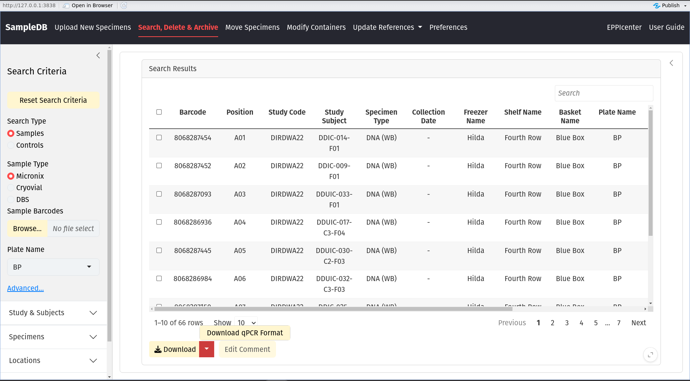
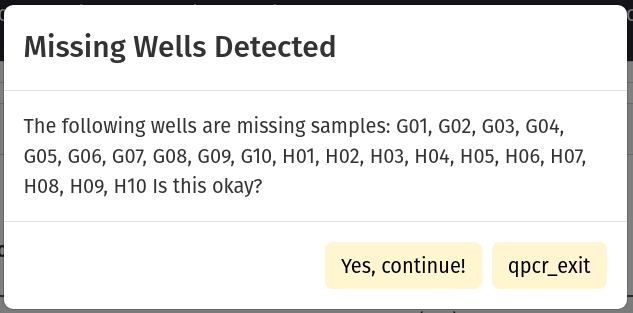
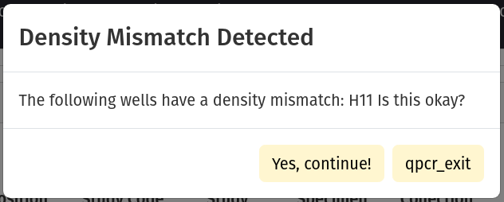
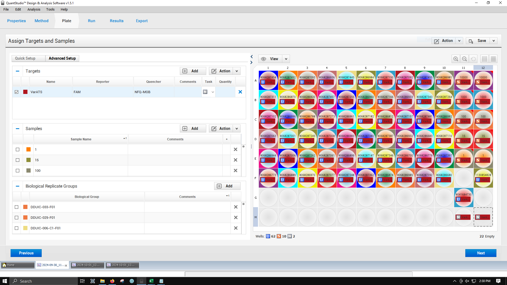

The section below will cover how to download a qPCR template for the QuantStudio3 Thermocycler. 

## Preparing your plate in SampleDB

```
Please review `How to Move Samples and Controls` page for more information on how to move samples and controls.
```

In order for SampleDB to generate a qPCR template for a plate, the plate <em>in SampleDB</em> must meet the following criteria.

1. Only controls may exist in wells A11-E11, and must be arranged in descending order by concentration.
2. Wells A12-E12 are to remain empty.
3. Wells H11 and H12 are reserved for the negative control.

These requirements are in place to ensure that samples and controls keep their metadata linked throughout the qPCR process by enforcing a standard layout. We use <em>Biological Replicates</em> for our controls and let SampleDB record the replicates in wells A12-E12 using information about the controls in wells A11-E11. These are the only requirements and will be checked (see 'Validation Details' below). You may have samples, controls or empty wells in wells A1-H10, F11-F12 and G11-G12.

You should scan your plate with the Traxcer scanner and generate a 'Move' file. Once completed, you should see your plate in the search panel with your samples and extracted controls.

## Downloading a qPCR Template

To begin the download, start by searching for your plate. If you attempt to start the process without searching for a plate, SampleDB will stop you.



You are allowed to have missing samples. If you do not have a sample in wells A1-H10, you will see the dialog below. Press 'Okay' to continue if you should have missing samples in the reported wells.



Controls are expected to decrement. In wells A11-E11, you are expected to have controls with densities <em>near</em> 10K, 1K, 100, 10, and 1 p / uL, respectively. The densities do not have to be exact. You will see the dialog below if SampleDB detects that the specified control does not have the expected density given it's position.

If everything looks okay, press 'Okay' to continue.



Finally, you will see a color-coded visualization of your plate. Wells with samples will be yellow and will have the micronix barcode and specimen type recorded in the cell. Wells with controls will be green and will have the micronix barcode, specimen type <em>and</em> density recorded. Wells that are empty with have no text and will be grey. 

The negative control (wells H11-H12) will say NTC in the first two rows (where other wells have a micronix barcode and specimen type), and will say 'Negative' in the third row where the density is ususally recorded.

<em>Proper image to be added here...</em>

If everything looks correct, press 'Download qPCR Table'. A tab-deliminited text file will be generated for you.

## How to upload your template to QuantStudio3 ThermoCycler

**You will need make sure the file is located on the computer that is controlling the thermocycler.**

Once you've opened the application, go to 'File' > 'Import Plate Experiment'. Enter the file that you have downloaded.

You should see a success dialog box, and your uploaded plate.



## Validation Details

There are two validation errors you may see.

### "Non-control in a standard position."

This means that there is a sample in wells A11-E11, which are reserved for controls, or in wells H11-H12, which are reserved for the negative controls.

### "Empty well in a standard position (non-NTC)."

This means that a control is missing in wells A11-E11.

